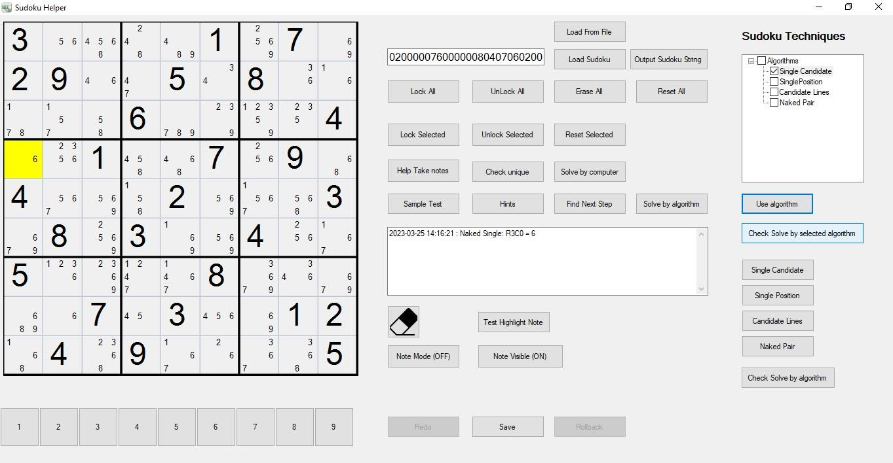

## Sudoku Helper
### This project is used to create a sudoku helper that provides some tools to help us to solve sudoku. It is a C# winform application so a window platform and .NET Framework are required to use this application.

---

## Environment:
- Windows
- .NET Framework (v4.7.2)

---

Current Status (Not completed): 

Version 1:

---

Sudoku Techniques:
- Single Candidate / Naked Single (Completed)
- Single Position / Hidden Single (Completed)
- Candidate Lines (Completed)

- Double Pairs (Pending)
- Multiple Lines (Pending)
- Naked Pairs / Triples (Pending)
- Hidden Pairs / Triples (Pending)
- X-Wings (Pending)
- Swordfish (Pending)

- Unique Rectangle (Pending)
- Wings Others (Pending)
- Chains (Pending)